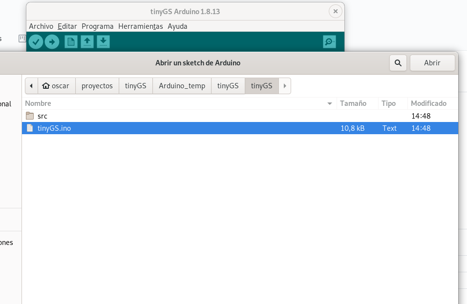
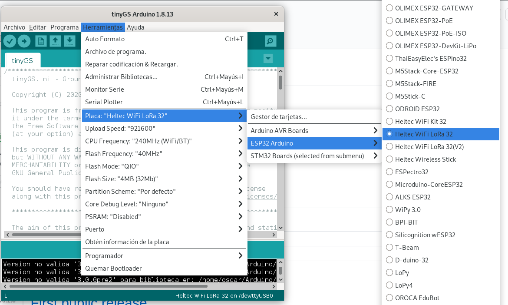

## Build on Arduino IDE
We strongly recommend using platformio, the build process is simpler and it is less likely to have compilation errors. https://github.com/G4lile0/ESP32-OLED-Fossa-GroundStation/wiki/Platformio

You can install the Arduino IDE by downloading it from [arduino.cc](https://www.arduino.cc/en/Main/Software), we recommend the last version, but you should use v1.6 or above.

### Install the Arduino Core for ESP32
First step is to install support for ESP32 based boards on the Arduino IDE through the Board Manager.

* Start Arduino and open Preferences window.
* Enter `https://dl.espressif.com/dl/package_esp32_index.json` into *Additional Board Manager URLs* field. You can add multiple URLs, separating them with commas. 
* Open Boards Manager from Tools > Board menu and find *esp32* platform.
* Select the version you need from a drop-down box.
* Click *install* button.

### Installing dependencies
This project relies on several third party dependencies that must be installed in order to be able to build the binaries. You can find the dependencies list below.

To install the libraries you can simply copy all files from the GroundStation folder `lib` into your sketchbook\libraries folder. Make sure there are no duplicate libraries that might cause a conflict.

* **RadioLib (with modifications)** (**required:** v4.2.0@G4lile0) https://github.com/G4lile0/RadioLib
* **ArduinoJson** (recomended v6.17.2 **Required** >v6.0) https://github.com/bblanchon/ArduinoJson
* **ESP8266_SSD1306** (recomended v4.2.0) https://github.com/ThingPulse/esp8266-oled-ssd1306
* **IoTWebConf2** (**Required:** 3.0.0@4m1g0) https://github.com/4m1g0/IotWebConf2
* **PubSubClient** (recomended 2.8) https://github.com/knolleary/pubsubclient
* **ESPNtpClient** (recomended 0.2.3) https://github.com/gmag11/ESPNtpClient
* **FailSafeMode** (recommended 0.2.2) https://github.com/gmag11/FailSafeMode

**Note**: Radiolib have modifications compared to the original one, so make sure you use the version listed here or just copy the libraries from the `lib`folder to avoid problems. 

### Open the project in Arduino IDE
Once you have cloned this project to a local directory, you can open it from the Arduino IDE in `File > Add folder` to workspace. And select the .ino file which is located in `FossaGroundStation > Fossa_GroundStation.ino`

### Build and upload the project
Connect the board to the computer, select your board in the Arduino IDE `Tools > Boards ` if you have doubts you can select `Heltec Lora 32 V1` this configuration will work for most of the boards based on ESP32.

Then select the port where the board is connected to the computer in `Tools > Ports`

And finally click on the rounded arrow button on the top to upload the project to the board or go to `Program > Upload (Ctl+U)`