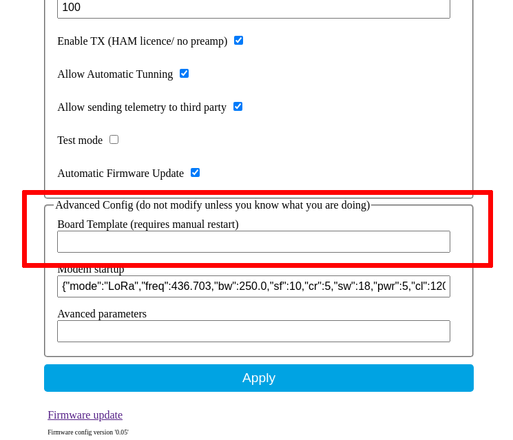

If you have one of the [supported boards](https://github.com/G4lile0/tinyGS/wiki/Ground-Station-configuration#current-available-boards) you just have to select it through the config dashboard of the ground station and the firmware will be configured acording to your hardware.

If you have a custom made board, or your board doesn't appear on the list, templates provide an easy way to create, modify and share pin configurations for any type of board you have without the need to modify the firmware. This is important not only because it makes it easier but also because it makes your configuration persistent after a firmware update.

## How to use it 



On the config dashboard you can go to the advanced options and fill the `Board Template` field with your custom template. If you want to go back to use the default boards, leave this field completely empty.

## Create your own template
The board templates have the following format:

```
{"name":"[433] Heltec LoRa V1","aADDR":60,"oSDA":4,"oSCL":15,"oRST":16,"pBut":0,"led":25,"radio":1,"lNSS":18,"lDIO0":26,"lDIO1":12,"lBUSSY":0,"lRST":14,"lMISO":19,"lMOSI":27,"lSCK":5,"lTCXOV":0.0}
```

  * **name**: Give a name to your board
  * **aADDR**: I2C address of the OLED display (in decimal format)
  * **oSDA**: OLED SDA pin
  * **oSCL**: OLED SCL pin
  * **oRST**: OLED RST pin
  * **pBut**: GPIO used for the board user button
  * **led**: GPIO used for the main board indicator led
  * **radio**: Type of radio module user by your board 0: sx166x, 1: sx127x
  * **lNSS**: LoRa NSS pin
  * **lDIO0**: LoRa DIO0 pin
  * **lDIO1**: LoRa DIO1 pin
  * **lBUSSY**: LoRa BUSY pin
  * **lRST**: LoRa RST pin
  * **lMISO**: LoRa MISO pin
  * **lMOSI**: LoRa MOSI pin
  * **lSCK**: LoRa SCK pin
  * **lTCXOV**: LoRa TXCO voltage (float value, only used for sx126x modules)

## Example templates
Here you can see some examples of templates:

### Heltec WiFi LoRa 32 V1
```
{"name":"[433] Heltec LoRa V1","aADDR":60,"oSDA":4,"oSCL":15,"oRST":16,"pBut":0,"led":25,"radio":1,"lNSS":18,"lDIO0":26,"lDIO1":12,"lBUSSY":0,"lRST":14,"lMISO":19,"lMOSI":27,"lSCK":5,"lTCXOV":0.0}
```

### TTGO LoRA 32 v2
´´´
{"name":"[433] TTGO LoRA 32 v2","aADDR":60,"oSDA":21,"oSCL":22,"oRST":16,"pBut":0,"led":22,"radio":1,"lNSS":18,"lDIO0":26,"lDIO1":33,"lBUSSY":0,"lRST":14,"lMISO":19,"lMOSI":27,"lSCK":5,"lTCXOV":0.0}
´´´