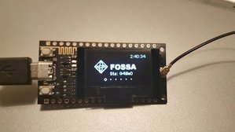
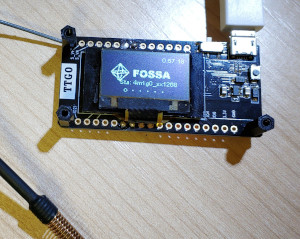

The Ground Station firmware provides a web panel for board configuration. This makes it easy to review the state of the ground station, change any parameter and even upload a new firmware remotely. Also it ensures that configuration is kept after a new firmware version is uploaded.

The first time the board boot it will generate an AP with the name: FossaGroundStation. Once connected to that network you should be prompted with a web panel to configure the basic parameters of your station. If that were not the case, you can access the web panel using a web browser and going to the url 192.168.4.1.

  
   

The parameters that must be filled are the following:
* **GROUNDSTATION NAME:** The name of your ground station. If you have registered yours in the [Fossa Ground Station Database](http://groundstationdatabase.com/database.php), the name should match. All ground stations starting with `test_` will be considered stations in test mode and all messages from those gs will be published on the [TEST telegram channel](https://t.me/FOSSASAT_TEST) in order not to flood the main channel with test packaged. Make sure you use a name stating with `test_` for example if you are going to test you gs with a satellite emulator.
 **GROUNDSTATION PASSWORD:** This is the password of your ground station, you will be asked for this password next time you connect to it through the web panel. **The user is always `admin`**
* **SSID and PASSWORD:** The configuration parameters of you home WiFi AP so that the ground station can connect to internet.
* **TIME ZONE:** Your timezone, this is to show you the time imformation in your timezone.
* **LATITUDE and LONGITUDE:** The geographical coordinates of the ground station. This serves the purpose of locating your ground station when you receive a package from the satellite.
* **MQTT_SERVER and MQTT_PORT:** These are the address and port of the MQTT server of the project you should not change them if you want the Ground Station to be able to connect the main server. 
* **MQTT_USER and MQTT_PASS:** These are the credentials of the project MQTT server, the purpose is to be able to collect the most packets from the satellite and manage all groundStations from this central server. You can ask for user and password in this telegram group: https://t.me/joinchat/DmYSElZahiJGwHX6jCzB3Q
* **BOARD TYPE:** The hardware board you are using. The firmware is able to autodetect your board but, in case the selection is wrong or you know what you are doing, you can change it manually by modifying this parameter.

## Current available boards
### HELTEC WiFi LoRA 32 V1
This is the stock Heltec v1 LoRa board, it should be detected automatically and be selected by default if you have this board. 

### HELTEC WiFi LoRA 32 V2
This is the version 2 of the Heltec LoRa board, if you have this board, probably it is not detected automatically and you have to select it on the confi panel manually. If you don't do so the Lora communication will not work.

### TTGO LoRa 32 v1
This is the first version of the TTGO LoRa board,it should be detected automatically and be selected by default if you have this board. 

### TTGO LoRA 32 v2
This is the version 2 of the TTGO LoRa board, if you have this board, probably it is not detected automatically and you have to select it on the confi panel manually. If you don't do so the Lora communication will not work.

### T-BEAM + OLED
Warning this board is supposed to work with this configuration but it will not be automatically detected and it's not properly tested yet. If you have this board we would like to hear your experience.

### Custom ESP32 Wroom + SX126x (Crystal)
This is a custom made ground station with a SX1268 module provided with a crystal oscillator (no TCXO). It is set up on a breadboard although a soldered protoboard is highly recommended if you decide to go for this type of setup. The OLED display is optional but also recommended.

Pin definition for this board is the following:

| Name   | GPIO  |
| ------- | ---- |
| OLED_SDA | 21  |
| OLED_SCL | 22 |
| OLED_RST | 16 |
| PROG_BUTTON | 0 |
| BOARD_LED | 25 |
| Lora_NSS | 5 |
| Lora_DI01 | 27 |
| Lora_BUSSY | 26 |
| Lora_RST | 14 |
| Lora_MISO | 19 |
| Lora_MOSI | 23 |
| Lora_SCK | 18 |

### TTGO LoRa 32 V2 Modified with module SX126x (crystal)
The TTGO V2 board comes with a soldered module on board. This means that, with a little patience, the appropriate tools and some expertise, it's possible to desolder the original SX127X lora module and solder a SX126X. This configuration is meant to use a SX126X with a crystal oscillator (no TCXO).

It's also needed to use jumper cables to connect LoRa pins DIO1 to GPIO 33 and BUSSY to GPIO 32 which are not connected on the TTGO V2 but exposed as pins.

### Custom ESP32 Wroom + SX126x DRF1268T (TCXO) (5, 2, 26, 13)

This is a custom made ground station with a SX1268 module provided with a TCXO. A soldered protoboard is highly recommended instead of a breadboard if you decide to go for this type of setup. The OLED display is optional but also recommended.

Pin definition for this board is the following:

| Name   | GPIO  |
| ------- | ---- |
| OLED_SDA | 21  |
| OLED_SCL | 22 |
| OLED_RST | 16 |
| PROG_BUTTON | 0 |
| BOARD_LED | 25 |
| Lora_NSS | 5 |
| Lora_DI01 | 2 |
| Lora_BUSSY | 13 |
| Lora_RST | 26 |
| Lora_MISO | 19 |
| Lora_MOSI | 23 |
| Lora_SCK | 18 |

### Custom ESP32 Wroom + SX126x DRF1268T (TCXO) (5, 26, 14, 12)
This is the is the same custom board as the previous one but with different GPIO arrangement. Both are kept for compatibility reasons.

Pin definition for this board is the following:

| Name   | GPIO  |
| ------- | ---- |
| OLED_SDA | 21  |
| OLED_SCL | 22 |
| OLED_RST | 16 |
| PROG_BUTTON | 0 |
| BOARD_LED | 25 |
| Lora_NSS | 5 |
| Lora_DI01 | 26 |
| Lora_BUSSY | 12 |
| Lora_RST | 14 |
| Lora_MISO | 19 |
| Lora_MOSI | 23 |
| Lora_SCK | 18 |

# Adding a custom board to the system
If you are planning to build your custom board, we recommend using one of the existant pin congigurations. In case you already have a board with a different configuration and is not possible to change, you can add your own pin configuration. To do so you can follow the example show in this commit: https://github.com/G4lile0/ESP32-OLED-Fossa-GroundStation/commit/d1f280fba51e214ca8b717e6b36ed69d5d22f68a

These are the steps:
* In `FossaGroundStation/src/ConfigManager/ConfigManager.cpp` add a new line to the `boards` variable with your pin definitions.
* In `FossaGroundStation/src/ConfigManager/ConfigManager.h` add a new line before `NUM_BOARDS` to the `boardNum` enum variable.
* In `FossaGroundStation/src/ConfigManager/htmlOptions.h` add the propiate option to the select field of the HTML so it appears on the web panel. The board number is it's position on the boards variable you edited before starting at 0.