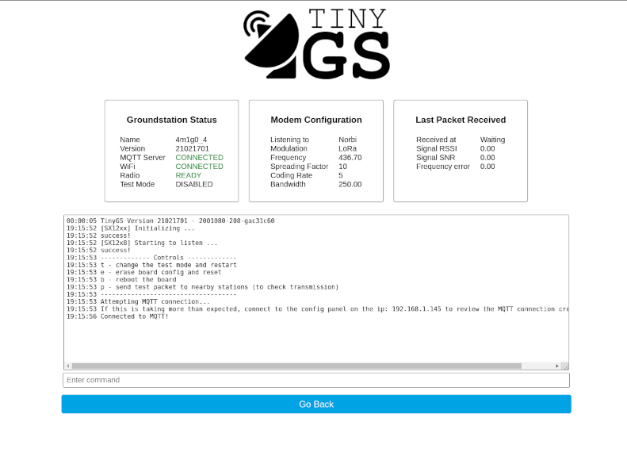

The local station dashboard can be access connecting to the station on the local network and use the browser to navigate to the IP that is shown on the OLED screen or on the tinyGS.com website.

On the left it show the status of the station, if it's connected to the server, to wifi and if the radio is configured and listening properly. In the middle it show the modem configuration parameters that the station is currently using and on the right the information of the last received packet is shown. Be aware that these do not refresh the information automatically, you will have to reload the page.

On the bottom there is a web console where all the events are logged by the system. When you connect to the local dashboard you will be able to scroll up and see events that occurred even before that you opened the page. In the near future the console will support input commands to control the station.