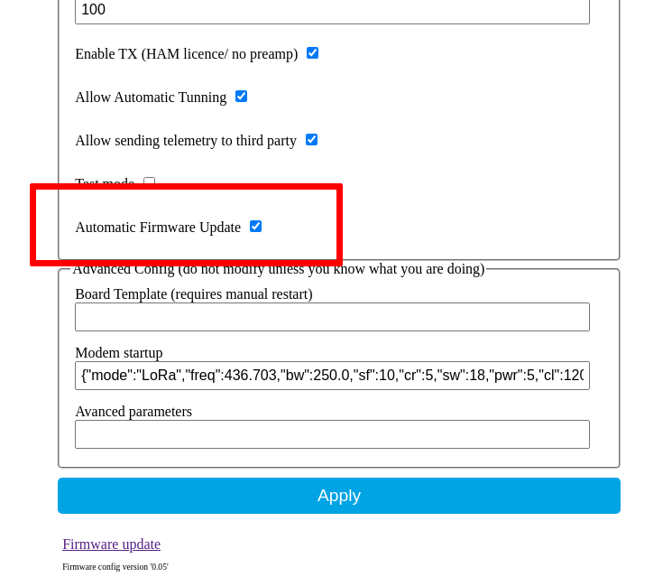
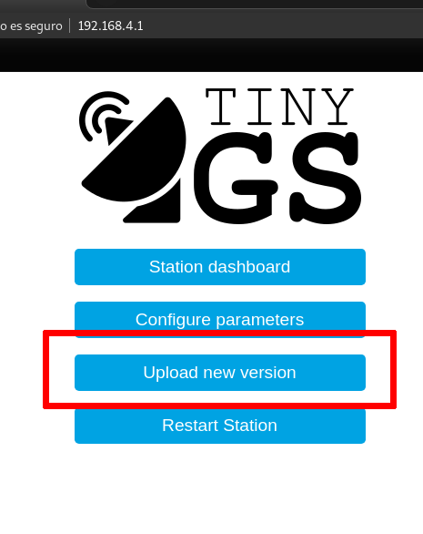

This project was designed to enable ota update, every configuration, including the hardware pinout is stored in memory and persisted after updates. This means that you can configure your board once and it will keep your configuration even if your re-flash a new firmware version.

TinyGS implements 3 OTA updates methods: Automagically, manually through the local config dashboard or through the IDE.

## Automagical update



On the local config dashboard there is an option to enable or disable automatic updates. If you leave this option enabled, the board will automatically check for updates periodically and update itself.

## Local dashboard update


If you login to your local config dashboard by introducing the board ip (shown in the OLED display) on your browser and selecting the option `Upload new version` you will be asked to upload a new bin file from your computer. You will find bin files attached to every TinyGS firmware release here: https://github.com/G4lile0/tinyGS/releases

Remember that the username of the config dashboard is always `admin` and the password is the one you set when you configured your station for the first time.

## IDE OTA Update
To use this flashing method the board and the computer have to be connected to the same network and be visible to each other.
### Platformio
In order to upload a new version through OTA in platformio, the `platformio.ide` file has to be edited uncommenting two lines to enable OTA and set the current IP Address of the station (it can be seen on the OLED display).

```
# Uncomment these 2 lines by deleting ";" and edit as needed to upload through OTA
;upload_protocol = espota
;upload_port = IP_OF_THE_BOARD
```

Once this is done, the new firmware can be uploaded using the upload button normally as if the board were connected through USB.

### Arduino IDE
To upload a new version through OTA on Arduino, you have to navigate to `Tools > port` and, if the computer is in the same network it should detect a network port for the ESP32. If that is the case, select the network port.

Once this is done, the new firmware can be uploaded normally using the upload button or navigating to `Program > upload`
