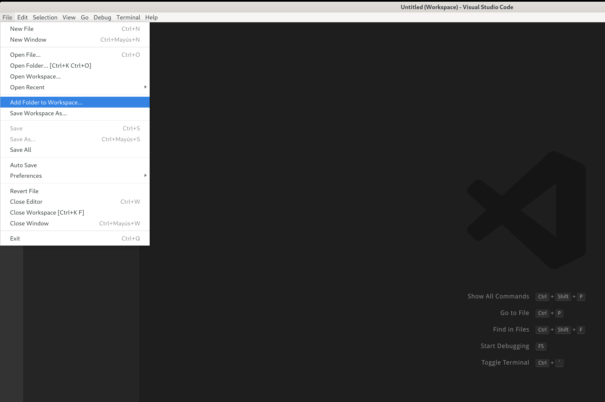
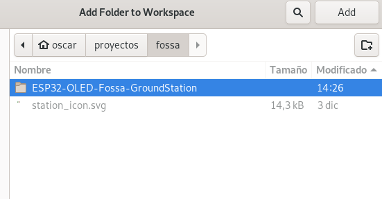
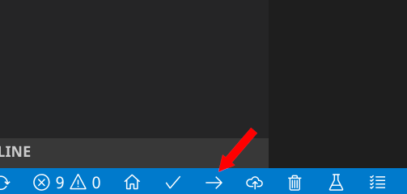

## Platformio
### Installing platformio
Platformio can be installed as a plugin for many IDEs. You can find a complete list here: https://docs.platformio.org/en/latest/ide.html#desktop-ide

My recommendation is to use VSCode or Atom, you can find installation guides here:

* VSCode: https://docs.platformio.org/en/latest/ide/vscode.html
* Atom: https://docs.platformio.org/en/latest/ide/atom.html

### Open the project in VSCode
Once you have cloned this project to a local directory, you can open it on Visual Studio code in File > Add folder to workspace.

Then select the `TinyGS` folder of the repository and click open, make sure it is the root folder and that it has the platformio.ino inside.

After that, the project should be loaded in visual studio and ready to configure and build. **There is no need to change anything on the code if you have one of the supported boards. Platformio will compile for heltec_wifi_lora_32 but that is normal even if your board is not Heltec.**

## Build and upload the project
Connect the board to the computer and click on the upload button from the platformio toolbar, or go to Terminal -> Run Task -> Upload.

All the dependencies will be configured and built automatically.

Note that if you are a Linux used like me and it is your first time using platformio, you will have to install the udev rules to grant permissions to platformio to upload the program to the board. You can follow the instructions here: https://docs.platformio.org/en/latest/faq.html#platformio-udev-rules