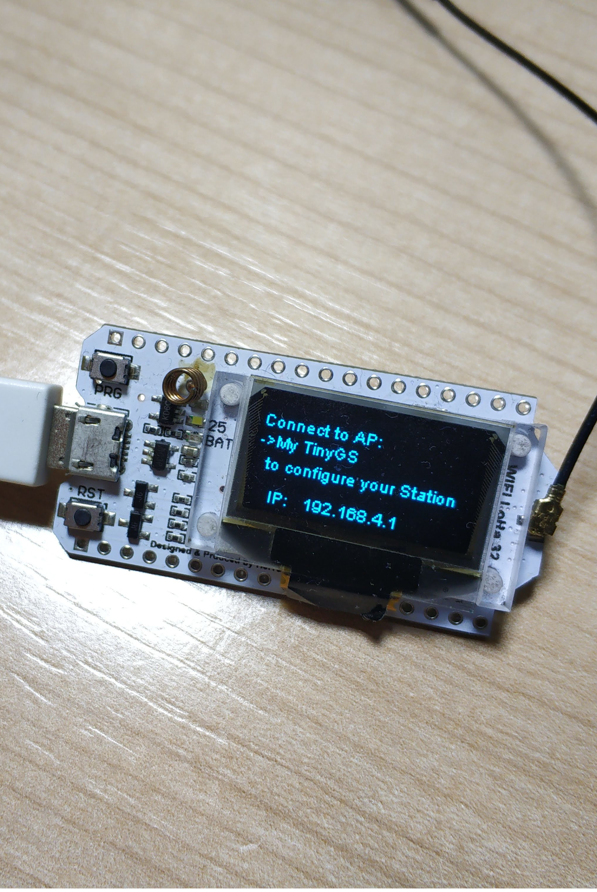

This quick guide show you how to easily upload the code to your board module using the TinyGS uploader, in one click, and available for Linux, Windows y Mac.

## Upload the firmware
First go to the [release page](https://github.com/G4lile0/tinyGS/releases) and download the TinyGS Uploader 

Once it is downloaded, execute it. On linux you might have to execute it from a terminal window and on Windows or Mac you might get an warning message like the following one. You have to click on _more options_ and _run anyway_.

Once it is running the only thing you have to do is connect your board to the computer via USB and click refresh. Make sure the right port is selected and click _Upload TinyGS firmware_.

Once the process finished the board will restart and start the booting process. It might take around 40 seconds to show something on the screen the first time it boots.

The TinyGS Uploader is still a experimental tool, if you have problems with it we recommend you to try the tradicional way using [Platformio](https://github.com/G4lile0/tinyGS/wiki/Platformio).

## Configure the board
The first time the board boot it will generate an AP with the name: My TinyGS. Once connected to that network you should be prompted with a web panel to configure the basic parameters of your station. If that were not the case, you can access the web panel using a web browser and going to the url `192.168.4.1`.

  
   

For more information about the board configuration you can follow this link: https://github.com/G4lile0/tinyGS/wiki/Ground-Station-configuration