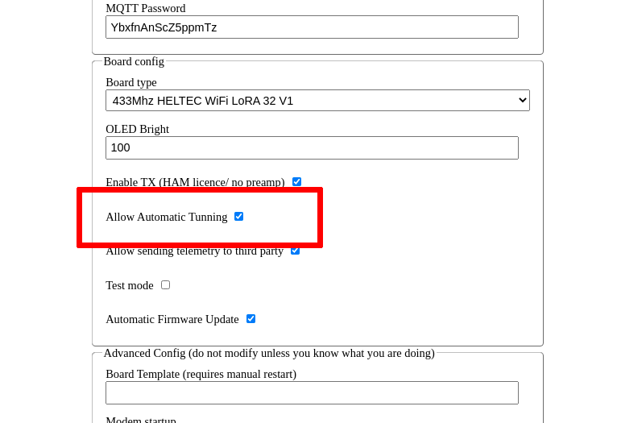
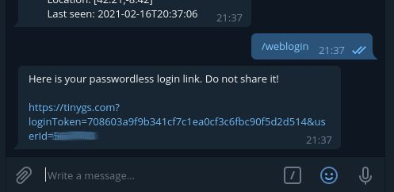
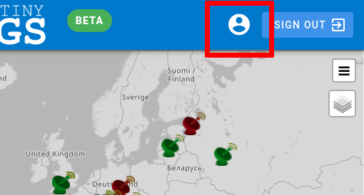
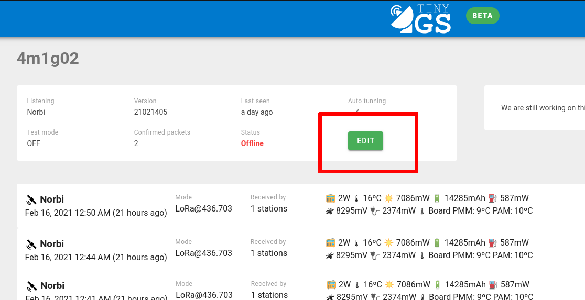
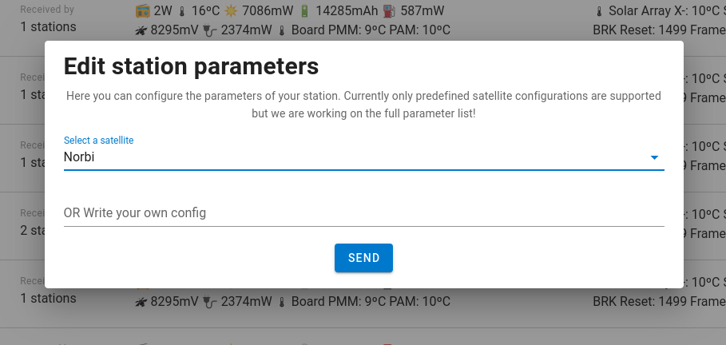
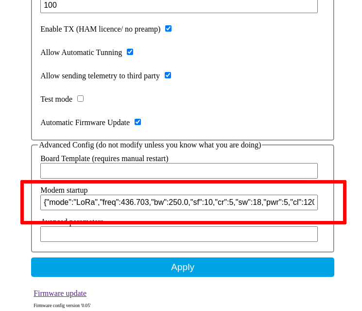

For the tinyGS groundstations to listen to a specific satellite, many parameters have to be adjusted. TinyGS provides with different methods to do so that can be classified in automatic or manual.

## Automatic tuning
On the local configuration dashboard of the board there is an option to enable or disable autoTuning.



If you enable this option, the server will configure your station to listen the most appropriate satellite and even change the configuration dynamically based on the satellites location and prediction so that your station maximizes the chances of receiving a frame.

At this moment this feature is experimental, but it will work reasonable well in most cases. Be aware that even with the remote tune option enabled, you still can manually select a default satellite configuration and it will be prioritized among others.

## Manual tuning
For experimentation purposes or to test new satellites, you might want to manually change the settings of your station. There are several ways to do so: from the web application, from the local config panel or through the programatical API.

### Change station parameters from the web application
The web application on https://tinygs.com has a personal dashboard where you can view your stations and control them remotely. To access the personal dashboard you have to use the command `/weblogin` on the `@tinygs_personal_bot` bot. It will provide you with a passwordless login link that will allow you to login into your panel.



Once you follow that link you will be logged into the web application and you will see a link to your personal dashboard on the top of the page.



Inside your dashboard you will see your statistics and the list of your stations. If you click on one of the stations you can see the station configuration as well as the packets received by such station. If you are properly logged in you will see an edit button to edit your station parameters.



Here you can choose between selecting one of the predefined templates to listen one of the supported satellites from the list or define your own template on the text field. You can find more information about modem templates bellow.



Be aware that if you have automatic tuning enabled, your configuration might change when you have another satellite overhead, however the system will try to prioritize your default configuration.

### Change the station parameters from the local config dashboard
If you login into the local web config dashboard you will see one parameter called `modem_startup`, this parameter will control the initial radio configuration of your station. Be aware that this parameter will be also modified when you change your station settings with any of the other methods.



The modem config string has the following form:

**LoRa**
 * **mode:** The radio mode `LoRa` or `FSK`
 * **freq:** Frequency
 * **bw:** Bandwith
 * **sf:** Spreading factor
 * **cr:** Lora coding rate
 * **sw:** Syncword
 * **pwr:** Power (for TX)
 * **cl:** Current limit
 * **pl:** Preamble length
 * **gain:** LNA Gain (0 = auto)
 * **crc:** true or false. Enable or disable crc.
 * **fldro:** 0: disable, 1: enable, 2: auto
 * **sat:** The satellite name
 * **NORAD:** The norad number of the satellite transmitter
 * **reg:** Custom register specification. This option allows to directly write on the registers of the radio module you can find more information about how to use it below.

Example:

```
{"mode":"LoRa","freq":436.703,"bw":250.0,"sf":10,"cr":5,"sw":18,"pwr":5,"cl":120,"pl":8,"gain":0,"crc":true,"fldro":1,"sat":"Norbi","NORAD":46494}
```

**FSK**
 * **mode:** The radio mode `LoRa` or `FSK` 
 * **freq:** Frequency
 * **bw:** Bandwith
 * **br:** Bitrate
 * **fd:** Frequency deviation
 * **pwr:** Power (for TX)
 * **pl:** Preamble length
 * **ook:** OOK modulation 0-4 sets the data shaping according to Radiolib, 255 disables OOk
 * **fsw:** Syncword Array of length 8
 * **sat:** The satellite name
 * **NORAD:** The norad number of the satellite transmitter
 * **reg:** Custom register specification. This option allows to directly write on the registers of the radio module you can find more information about how to use it below.

```
{"mode":"FSK","freq":437.77,"br":9.6,"fd":25,"bw":200,"pwr":10,"cl":100,"pl":0,"ook":0,"fsw":[4,53,46,53,46],"sat":"reaktor-hello-world","NORAD":43743}
```
#### Register specification
Some satellites, especially in FSK will require to directly change the registers of the radio module to specific bytes. Be aware that this is an advanced feature and an incorrect configuration might even damage your device.
A register modification has the following form: `[9984, 328970]` those two 32 bit int values encode 4 8bit values: reg, value, msb, lsb and checkInterval, so that the previous command will be equivalent to reg: 39, value: 0, msb: 5, lsb: 5, checkInterval: 10
```
9984 = (39 << 8) & (0)
328970 = (5 << 16) | (5 << 8) | (10)
```


### Change your station parameters from the programmatic API
The last method for controlling your station is by the programmatic API, this API is designed to control your station from a script running on your computer. You can control all the parameters of your station and even get data from the API.

You can take a look at this guide to get started with the programmatic API: https://github.com/G4lile0/tinyGS/wiki/Programmatic-API
