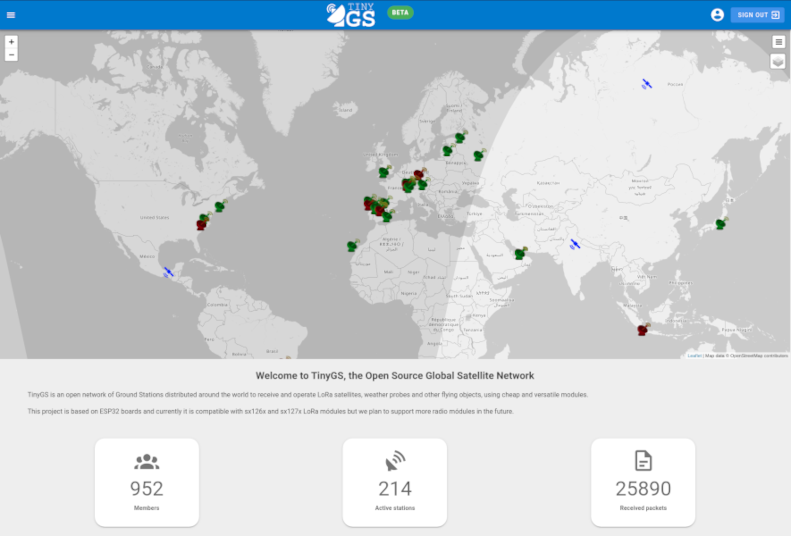
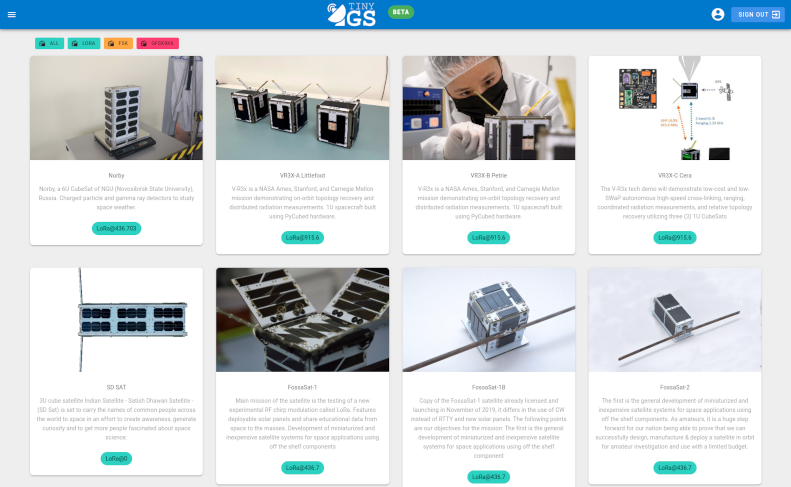
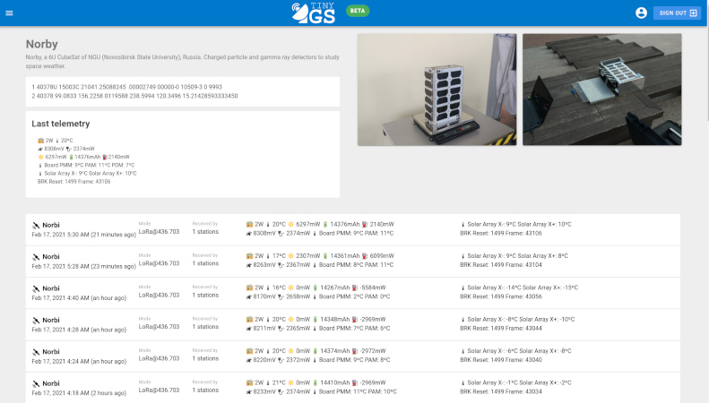
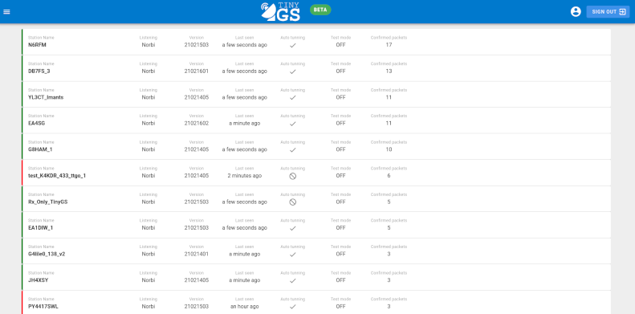
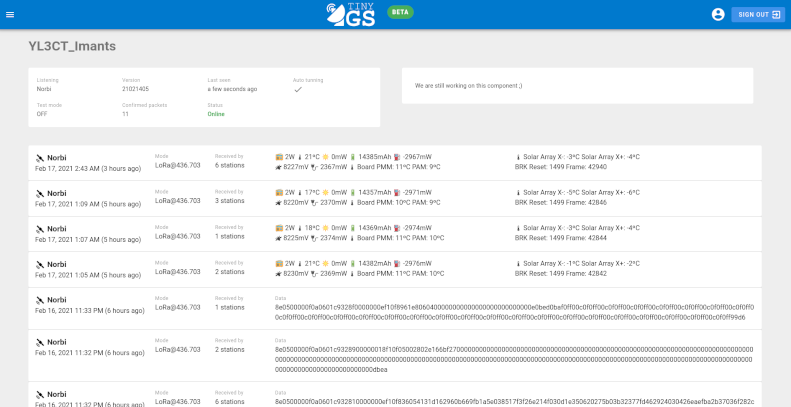

The web application is designed to be the center of the TinyGS system. Lately the group has grown so much that using Telegram for everything is no longer viable. We receive so much traffic that we have to be selective with what to send to Telegram in order to not make unnecessary flood and to stay within the Telegram quota. With the web application all the data can be kept organized and well structured.

As you might notice the web application is still a work in progress and we are currently adding more content and functionality.

## Home page

On the home page you can see live statistics about the current state of the community, number of active stations, total packers, etc. Also you can see the map of stations and satellites.

## Satellite list
On this page you can see the currently active satellites as well as the future launch. Not all these satellites are supported but if they are in the list, it means they transmit with compatible modulations and we want to experiment with them.

## Satellite detail
On this page you can see all the information of the satellite: it's TLEs, last telemetry, history, launch date as well as the list of packets received from that satellite. We also plan to add charts to show the historical records of different values like battery or power consumption.

The packets shown on this page are always packets that pass the structure test of the satellite protocol, so they are real packets and not noise.

## Station list
On this page you can see all the stations that where active in the last 24 hours. Stations marked as green are currently only and the red ones are offline. The station is sorted by the number of __confirmed telemetry packets__ received by the station.

## Station detail
On this page you can see the details of the station: version, radio parameters, configuration, as well as all the packets received by the station. On the station page the packages are not filtered everything that was received by the station will show up on this list. Including test packets, CRC errores and pure noise.

From this page you can also edit your station remotely and change the receiving parameters to make it listen to another satellite. To do so, you need to first log in into the web application using telegram. Take a look at the [Radio Tuning Guide](https://github.com/G4lile0/tinyGS/wiki/Radio-Tuning-Guide) to learn more.

## Packet list
On this page you can see the list of all the confirmed packets received by the network. Here only the packets that pass the structure test of any of the satellites are shown.