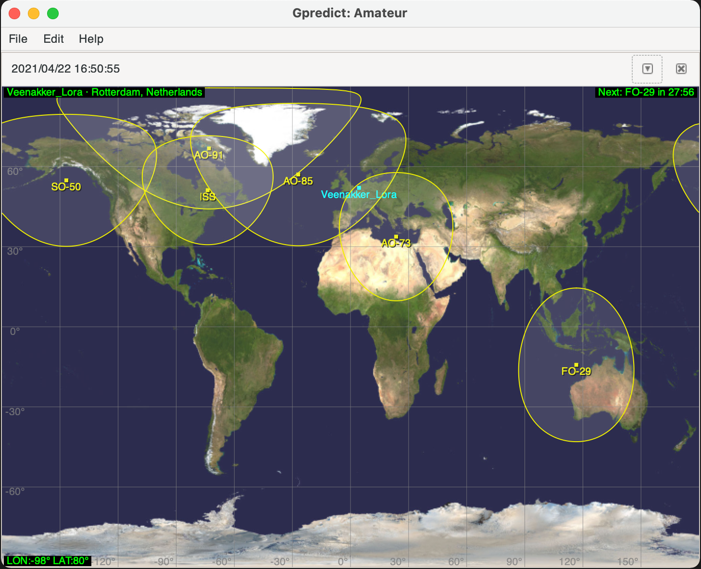
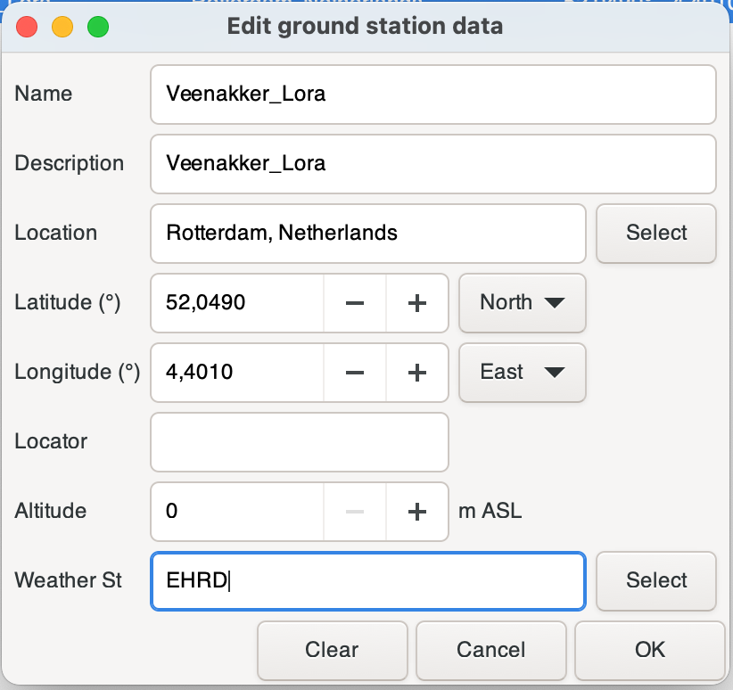

## Introduction

[gpredict](http://gpredict.oz9aec.net/) is a graphical opensource program to visualize satellite locations across the earth. It helps you track satellite and predict the orbit of satellites.

For TinyGS stations this is a handy tool to predict when the groundstation could potentionally be in reception range of a satellite.

## Prerequisites

Make sure your system is capable of running gpredict. Either on a linux or mac system. Once installed load the application start it up and you'll be welcomed by a default screen showing a few satelites and the ISS space station.

## Setup gpredict for TinyGS

In order to show up the relevant TinyGS satellites in gpredict we need to configure a new module and download the relevant TLE data.

1. Go to **Edit** and select **Preferences**
2. In **General** click the tab called **Ground Stations** and **Add New**
3. Fill out the relevant data, where the **Latitude** and **Longitude** are the most important to visualise your place on the world map.

4. In the **TLE Update** tab, click on **Add TLE source**. This will add a new line at the bottom names *http://server.com/file.txt*. Replace this text with the correct [TLE](TLE) url.
5. On completion click **OK** and go back to the main screen.
6. Click on **Edit** and **Update TLE data from network**

The basic steps are now done, and now we can move on to the actual visualisation.

7. Go to **File** and select **New Module**
8. Give the module a name.
9. Select your the **Ground Station** you've created in step 2.
10. Select the desired **Satellites** you want to see. Suggested values can be found [here](https://tinygs.com/satellites)
    

11. Press **OK** and behold a nice view of earth with your groundstation visible and the satellites in the air.